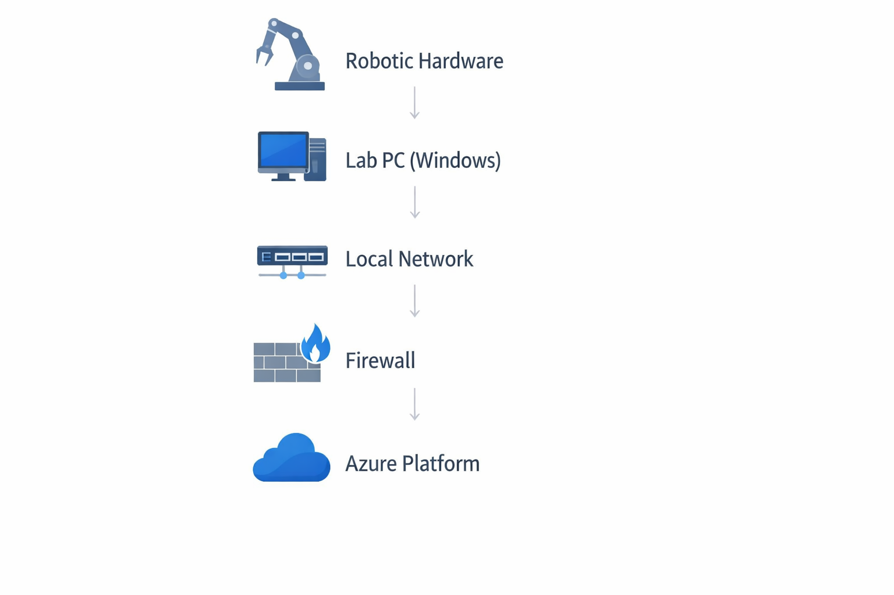

# Lab PC Infrastructure Migration & Azure Integration Blueprint
This blueprint simulates a real-world laboratory PC migration scenario involving full Windows imaging, hardware replication validation, and secure Azure platform integration with automation-driven rebuild procedures.

---
## Repository Structure

| Phase | Description | Link |
|-------|------------|------|
| Phase 1 | Backup & Validation | [Open](01-Backup-Strategy/) |
| Phase 2 | Hardware Replication | [Open](02-Hardware-Replication/) |
| Phase 3 | Azure Integration | [Open](03-Azure-Integration/) |
| Phase 4 | Rebuild Framework | [Open](04-Rebuild-From-Scratch/) |
| Phase 5 | Automation | [Open](05-Automation/) |
---
## Project Highlights

- Full Windows system imaging & validation strategy
- Hardware portability replication framework
- Secure Azure connectivity validation
- Automation-driven rebuild procedures
- Infrastructure documentation discipline
## Architecture Overview

This diagram illustrates the end-to-end infrastructure data flow:

Robotic Hardware → Lab PC (Windows) → Local Network → Firewall → Azure Platform.

This repository demonstrates a structured migration and validation framework for Windows-based laboratory PCs integrating with Azure-hosted infrastructure.

The objective is to enable:

- Full system image backup & restoration
- Hardware portability validation
- Secure Azure connectivity
- End-to-end data flow validation
- Complete rebuild-from-scratch documentation
- Automation-driven validation

This project mirrors real-world lab infrastructure migration and recovery scenarios.

---

## Project Phases

### Phase 1 – System Backup & Validation  
[View Backup Strategy →](01-Backup-Strategy/)
- Capture full Windows system image
- Export driver & software inventory
- Validate restore integrity
- Test boot & service functionality

### Phase 2 – Hardware Replication  
[View Hardware Replication Framework →](02-Hardware-Replication/)
- Map hardware dependencies
- Validate driver portability
- Confirm BIOS/UEFI configuration
- Validate robotic device connectivity

### Phase 3 – Azure Secure Connectivity  
[View Azure Integration Assets →](03-Azure-Integration/)
- Configure secure outbound connectivity
- Validate DNS & firewall rules
- Test Azure endpoint communication
- Confirm encrypted data flow

### Phase 4 – Clean System Rebuild Framework  
[View Rebuild Documentation →](04-Rebuild-From-Scratch/)
- Reinstall OS from scratch
- Reapply drivers and middleware
- Validate robotic software stack
- Confirm full data path to Azure

### Phase 5 – Automation  
[View PowerShell Automation Scripts →](05-Automation/)
Includes PowerShell automation scripts for:
- Baseline system export
- Connectivity validation
- Backup integrity verification

---

## Technologies Demonstrated

- Windows 10/11
- PowerShell Automation
- Azure Integration
- DNS Validation
- Backup & Restore Strategy
- Infrastructure Documentation Discipline

---

## Intended Outcome

A reproducible, documented lab PC migration and recovery framework enabling:

- Fast rebuild from scratch
- Hardware replacement without data loss
- Secure Azure integration
- Repeatable validation process
